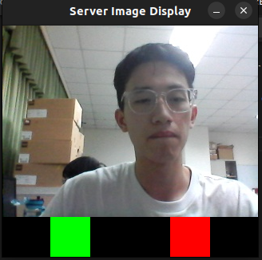

# TCP/IP Photo Transfer Program
- This is a front/back camera photo transfer program using TCP/IP protocol.

- Can use **multithreading** to transfer a photo to multiple clients at the same time.

- Use SDL2 to display the photo and can use the mouse to click the red or green bottom to decide whether to alarm.

## Execute
- Change the IP address in the code to the IP address of the server.
- Change the PORT in the code to the port you want to use.
```bash
make

# Terminal 1/2
./front_server_tcp
./back_server_tcp

# Terminal 3/4
./front_client_tcp
./back_client_tcp

```

## Result Image

