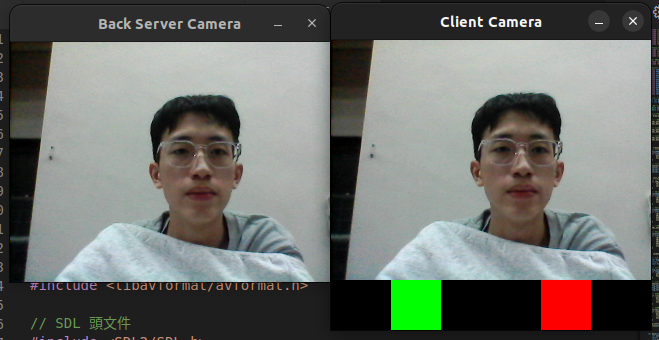

# UDP realtime video transfer program
- Use libv4l2 to get the video stream from the camera.

- This is a front/back camera realtime video transfer program using UDP protocol.

- Can use **multithreading** to transfer realtime video to multiple clients at the same time.

- Use SDL2 to display the photo and can use the mouse to click the red or green bottom to decide whether to alarm.

## Execute
- Change the IP address in the code to the IP address of the server.
- Change the PORT in the code to the port you want to use.
```bash
make

# Terminal 2
./front_realtime_server_udp
./back_realtime_server_udp

# Terminal 2
./front_realtime_client_udp
./back_realtime_client_udp

```
## Result Image

