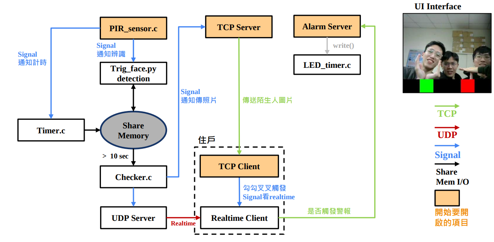
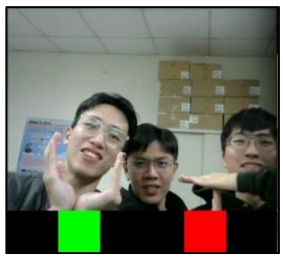
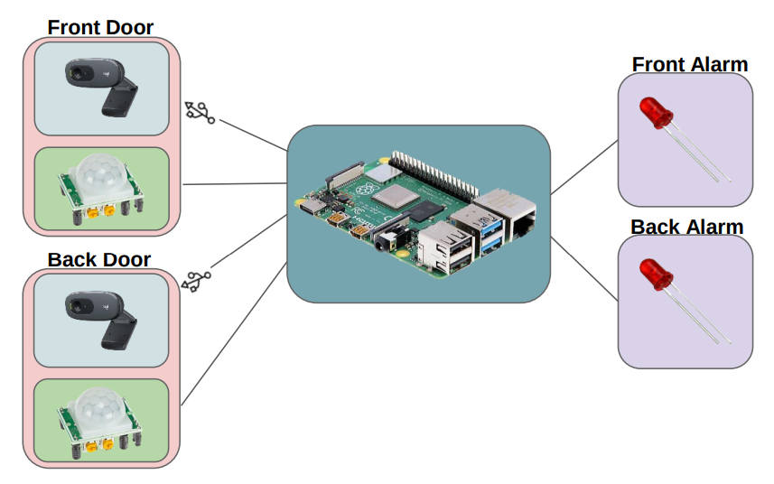
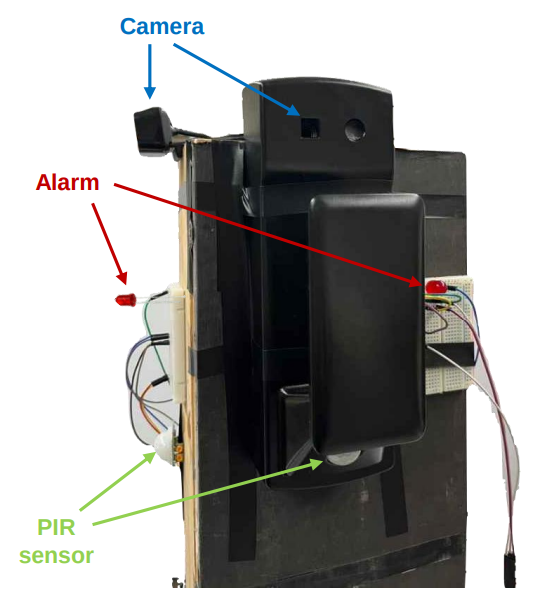
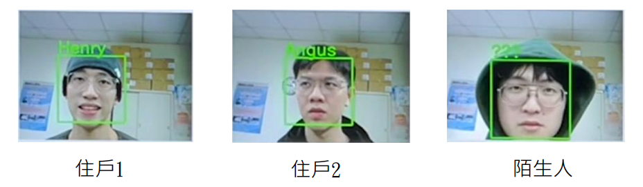

# Home Security System

## Project Overview
This project aims to develop an automatic detection system designed to identify intruders at the doorstep. It is equipped with a user interface accessible to every resident, facilitating interaction with the system to prevent unauthorized entry into homes. The system primarily consists of three components: Infrared Detection, Program Detection, and Remote Image Viewing, each available to all residents.

### System Components
1. **Infrared Detection**: Detects the presence of people near the door.
2. **Program Detection**: Identifies strangers and triggers an alarm.
3. **Remote Realtime Image Viewing**: Determines if the person is suspicious.

## System Architecture
The system inculde face recognition, UDP and TCP communication protocols, multithreading, and shared memory, ensuring efficient and accurate person identification and data transmission. The architecture includes a central server, Camera module, and alarm system.


### Key Features
- **Stranger Loitering Confirmation**: Continuous image analysis to determine if a stranger is loitering outside the door.
- **Alarm System**: Triggers an alarm and notifies residents upon threat detection.

## UI Interface
- the UI that can chose the mode of the system
- Yes/No to check the TCP image of the front and back camera and request the realtime image from the server


## Hardware Requirements
The system uses Raspberry Pi as the core computing unit, complemented by specific image sensors and alarm devices for security monitoring. Raspberry Pi requires the latest version of Image for optimal performance.

### Hardware
- Hardware: Raspberry Pi 4B* 1, Camera* 2, PIR Sensor* 2, LED* 2


- Actual architecture



## Software Design
The system employs OpenCV for face recognition, supporting cross-platform operations. The system's UI interface is designed based on QT for intuitive interaction.

### Technical Details
- **Lightweight Recognition System**: Uses a single model to recognize images from front and rear cameras, stored in shared memory.
- **Real-time Image Streaming**: Utilizes UDP protocol for transmitting real-time images, ensuring smoothness and immediacy.

### Face_recognition
- recognitino the face and show the name of the specific person


## Execute
- Check the IP of the server.
- Change the IP address of the client.
- Change the PORT in the code to the port you want to use.
```bash
# after cmake all facitility

# Raspberry pi
./Final_raspberry/demo.sh

# All client
## Terminal 1
./Final_project/deliver_photo/front_client_tcp
## Terminal 2
./Final_project/deliver_photo/back_client_tcp

```

